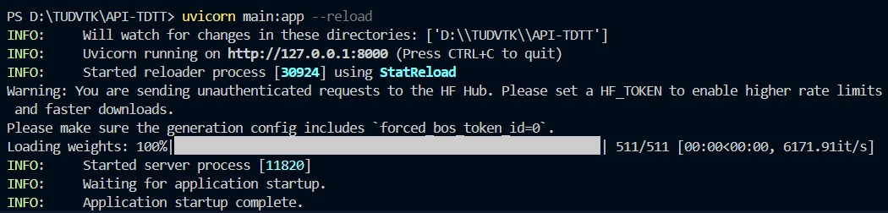
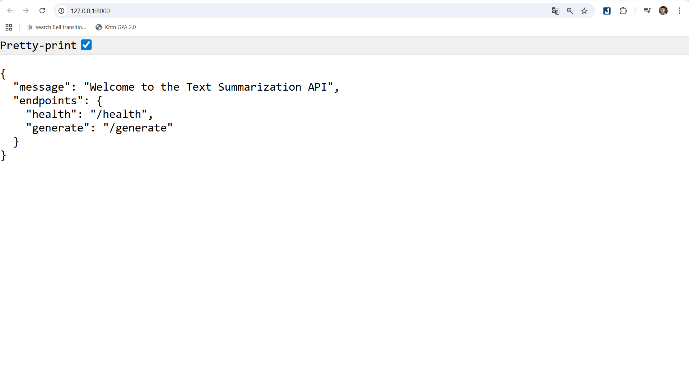
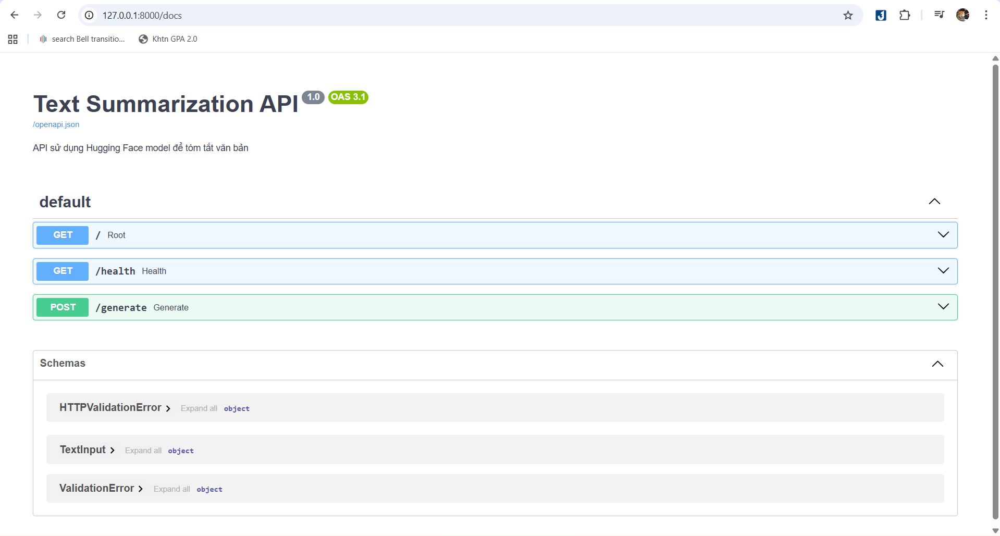
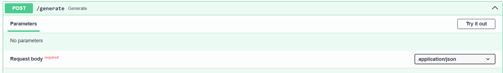
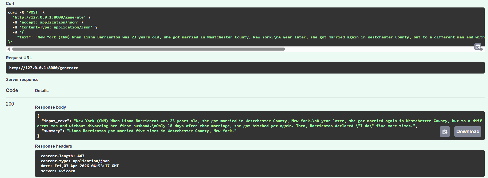
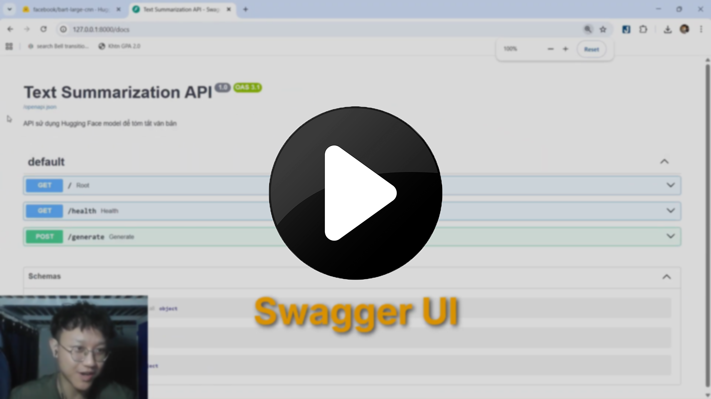

# Text Summarization API

## 1. Thông tin sinh viên

* **Họ và tên:** Đỗ Trung Kiên
* **Mã số sinh viên:** 24120350
* **Lớp:** 24CTT3

---

# 2. Mô hình sử dụng

Hệ thống sử dụng mô hình **facebook/bart-large-cnn** để thực hiện tác vụ **Text Summarization (Tóm tắt văn bản)**.

Link mô hình trên Hugging Face:
https://huggingface.co/facebook/bart-large-cnn

---

# 3. Mô tả hệ thống

Đây là một hệ thống **REST API** được xây dựng bằng **FastAPI** cho phép người dùng gửi văn bản đầu vào và nhận lại bản tóm tắt của văn bản đó.

Hệ thống sử dụng mô hình học sâu từ Hugging Face để thực hiện quá trình suy luận (inference) và trả kết quả dưới dạng **JSON**.

Các chức năng chính của API:

* `GET /`
  Trả về thông tin giới thiệu hệ thống.

* `GET /health`
  Kiểm tra trạng thái hoạt động của API.

* `POST /generate`
  Nhận văn bản đầu vào và trả về bản tóm tắt.

---

# 4. Hướng dẫn cài đặt thư viện

## 4.1 Cài đặt Python

Yêu cầu:

* Python **3.10 trở lên**

Kiểm tra Python:

```bash
python --version
```

hoặc

```bash
py --version
```

---

## 4.2 Cài đặt thư viện cần thiết

Cài đặt các thư viện bằng pip:

```bash
pip install fastapi
pip install uvicorn
pip install transformers
pip install torch (Nếu dùng CPU thông thường)
pip3 install torch torchvision --index-url https://download.pytorch.org/whl/cu128 (Nếu máy có GPU nvidia mạnh thì nên dùng)
pip install requests
```

Hoặc cài đặt tất cả cùng lúc:

```bash
pip install fastapi uvicorn transformers torch
```

---

# 5. Hướng dẫn chạy chương trình

Di chuyển tới thư mục chứa project.

Sau đó chạy server trên terminal bằng lệnh:

```bash
uvicorn main:app --reload
```

Nếu sử dụng Python launcher:

```bash
py -m uvicorn main:app --reload
```

Server sẽ chạy tại địa chỉ:

```
http://127.0.0.1:8000
```

---

# 6. Hướng dẫn gọi API

Sau khi server chạy, có thể truy cập tài liệu API tại:

```
http://127.0.0.1:8000/docs
```

Đây là giao diện **Swagger UI** để test API trực tiếp.

---

# 7. Ví dụ Request và Response

## 7.1 Endpoint

```
POST /generate
```

---

## 7.2 Request Body
Nhấp vào Try it out --> Điền input Json --> Nhấp execute
 
```json
{
    "text": "New York (CNN) When Liana Barrientos was 23 years old, she got married in Westchester County, New York.\nA year later, she got married again in Westchester County, but to a different man and without divorcing her first husband.\nOnly 18 days after that marriage, she got hitched yet again. Then, Barrientos declared \"I do\" five more times."
}
```

---

## 7.3 Response

```json
{
  "input_text": "New York (CNN) When Liana Barrientos was 23 years old, she got married in Westchester County, New York...",
  "summary": "Liana Barrientos got married five times in Westchester County, New York.."
}
```
 

## 7.4 Cách để dừng server Uvicorn
Dùng tổ hợp phím Ctrl + C trong terminal để dừng chương trình

---
# 8. Cách để kiếm tra cấu hình GPU có chạy không (Có thể bỏ qua phần này nếu máy bạn không có GPU nvidia mạnh)
Chạy trong terminal:

```bash
while ($true) { cls; nvidia-smi; Start-Sleep -Seconds 5 }
```

Để dừng chương trình thì cũng dùng tổ hợp phím Ctrl + C
---
# 9. Video demo
[](https://www.youtube.com/watch?v=T8Ke5fnm-ts)

---